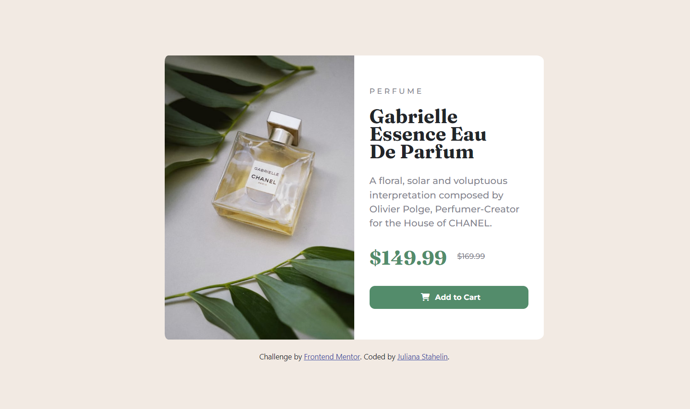

# Product Preview Card Challenge - Frontend Mentor

This is a challenge I completed from [Frontend Mentor](https://www.frontendmentor.io/challenges/product-preview-card-component-GO7UmttRfa).
It is a product preview card for a Gabrielle Essence Eau De Parfum.

## Overview

### The Challenge
Users should be able to:
- View the optimal layout depending on their device's screen size
- See hover and focus states for interactive elements

### Screenshot

### Links
- Solution URL: [https://github.com/julianastahelin/product-preview-card](https://github.com/julianastahelin/product-preview-card)
- Live Site URL: [https://julianastahelin.github.io/product-preview-card/](https://julianastahelin.github.io/product-preview-card/)

## My process

### Built with 👩🏽‍💻
- HTML 5
- CSS 3
- Bootstrap 5.3

### What I learned 💪🏽
- HTML Landmark elements
- Using the HTML Picture tag
- Using Viewport height (vh)
